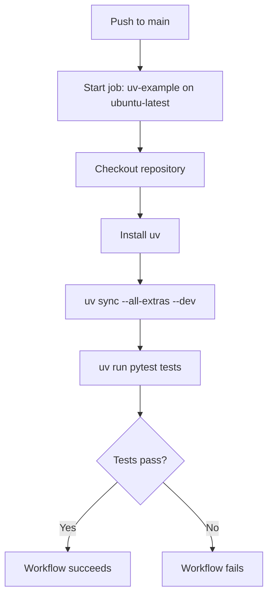
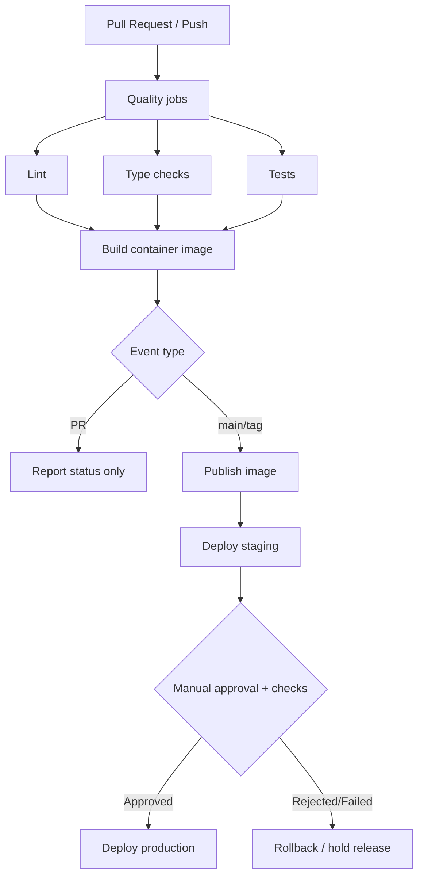

# GitHub Actions Pipeline Overview

This document explains the current CI workflow in `.github/workflows/main.yaml`, what it does well, and what should be added for production-grade CI/CD.

## Current Workflow at a Glance

The current pipeline is intentionally minimal: it runs tests on pushes to `main` using `uv` for dependency management and execution.



---

## Block-by-Block Explanation of `.github/workflows/main.yaml`

## 1) Trigger conditions

```yaml
on:
  push:
    branches:
      - "main"
```

- **What it does:** Starts the workflow only when a commit is pushed to the `main` branch.
- **Implication:**
  - Pull requests are **not** validated before merge unless they are merged into `main` first.
  - Feature branches do not automatically run CI.
- **Risk:** Bugs can be introduced before CI feedback is available to reviewers.

## 2) Checkout and uv setup

```yaml
steps:
  - uses: actions/checkout@v4

  - name: Install uv
    uses: astral-sh/setup-uv@v5
```

- `actions/checkout@v4` pulls the repository contents into the runner so subsequent steps can access project files.
- `astral-sh/setup-uv@v5` installs `uv`, the Python package/environment manager used by this project.
- **Good practice already in place:**
  - Pinned major versions for actions (`v4`, `v5`).
  - Uses an official setup action for tool install instead of custom scripts.

## 3) Dependency sync strategy

```yaml
- name: Install the project
  run: uv sync --all-extras --dev
```

- **What this does:** Creates/synchronizes the environment using lockfile/pyproject metadata and installs:
  - base dependencies,
  - all optional extras (`--all-extras`),
  - development dependencies (`--dev`).
- **Why it’s useful:**
  - Reproducible installs in CI when lockfiles are committed.
  - Ensures tests run with dev tooling available.
- **Tradeoff:** Installing all extras can increase CI time if many optional groups are unrelated to testing.

## 4) Test execution

```yaml
- name: Run tests
  run: uv run pytest tests
```

- **What this does:** Runs the test suite in the managed environment via `uv run`.
- **Current scope:** Executes only tests under `tests` path.
- **Output:** Workflow fails if pytest exits non-zero.

---

## What Is Missing for Production CI/CD

The current workflow validates core tests, but production delivery generally needs additional quality gates and deployment stages.

## 1) Lint and type checks

Add separate jobs/steps for code quality:

- **Linting/format checks** (e.g., Ruff, Black check mode).
- **Static type checking** (e.g., MyPy/Pyright).
- **Security scanning** (e.g., `pip-audit`, `bandit`, dependency review).

Recommended pattern:

- Run lint/type jobs on `pull_request` and `push`.
- Fail fast before expensive build/deploy jobs.
- Optionally split into matrix jobs for parallelism.

## 2) Build and publish container image

For deployable services, add containerization steps:

- Build image with Docker Buildx.
- Tag images with:
  - commit SHA,
  - semantic version tag (when applicable),
  - `latest` (optional, controlled usage).
- Push to registry (GHCR, ECR, GCR, etc.).
- Generate/provide SBOM + provenance attestations where required.

Recommended jobs:

1. `build-image` on PR (build only, no push for forks).
2. `publish-image` on main/tag (push signed image to registry).

## 3) Environment-based deploy jobs

Introduce progressive deployments with GitHub Environments:

- `deploy-staging` after successful test/build on `main`.
- `deploy-production` after staging verification and explicit approvals.

Use:

- environment protection rules (required reviewers, wait timers),
- per-environment secrets,
- clear rollout/rollback scripts.

## 4) Required secrets and branch protections

### Secrets/variables to define

At minimum (names are examples):

- `REGISTRY_USERNAME` / `REGISTRY_PASSWORD` (or OIDC-based auth preferred).
- `CLOUD_ROLE_ARN` / cloud credentials for deploy target.
- `KUBE_CONFIG` or cluster access credentials (if Kubernetes).
- `STAGING_APP_CONFIG`, `PROD_APP_CONFIG` (runtime config/materialized secrets).
- `SLACK_WEBHOOK_URL` (optional notifications).

### Branch protection recommendations for `main`

- Require pull request before merging.
- Require status checks to pass (tests + lint + type + build).
- Require up-to-date branch before merge.
- Require at least one approval (or code owners as needed).
- Restrict direct pushes to `main`.
- Optional: require signed commits.

---

## Recommended Target Pipeline (High-Level)



---

## Failure Triage Checklist

Use this checklist when the pipeline fails:

1. **Identify failing job/step quickly**
   - Open workflow run summary.
   - Locate first failing step and error line.

2. **Classify failure category**
   - Dependency/install issue (`uv sync` failure).
   - Test regression (`pytest` failures).
   - Lint/type violation.
   - Infrastructure/auth issue (registry/cloud/deploy).

3. **Validate reproducibility locally**
   - Run equivalent commands locally:
     - `uv sync --all-extras --dev`
     - `uv run pytest tests`
   - Confirm whether issue is CI-only or general.

4. **Check recent change surface**
   - Review files changed in failing commit.
   - Prioritize changes affecting dependencies, tests, workflow, or deployment config.

5. **Inspect secrets/permissions for deploy failures**
   - Token expiry/rotation.
   - Environment-scoped secret availability.
   - GitHub environment approval/protection blockers.

6. **Assess flakiness**
   - Re-run failed jobs if failure seems transient.
   - If flaky test detected, quarantine/fix and add issue reference.

7. **Recovery action**
   - Fix-forward with a targeted commit and re-run.
   - For production deploy failure, stop rollout and execute rollback plan.

8. **Post-incident hardening**
   - Add missing checks/alerts.
   - Improve logs/artifacts for faster root-cause analysis.
   - Update this document and runbooks.

---

## Suggested Next Iteration

A practical next step is extending `.github/workflows/main.yaml` with:

1. `pull_request` trigger.
2. Separate `lint`, `typecheck`, and `test` jobs.
3. Conditional image publish job on `main`/tags.
4. Environment-protected `deploy-staging` and `deploy-production` jobs.

This keeps the current workflow style while introducing production-safe CI/CD controls incrementally.
